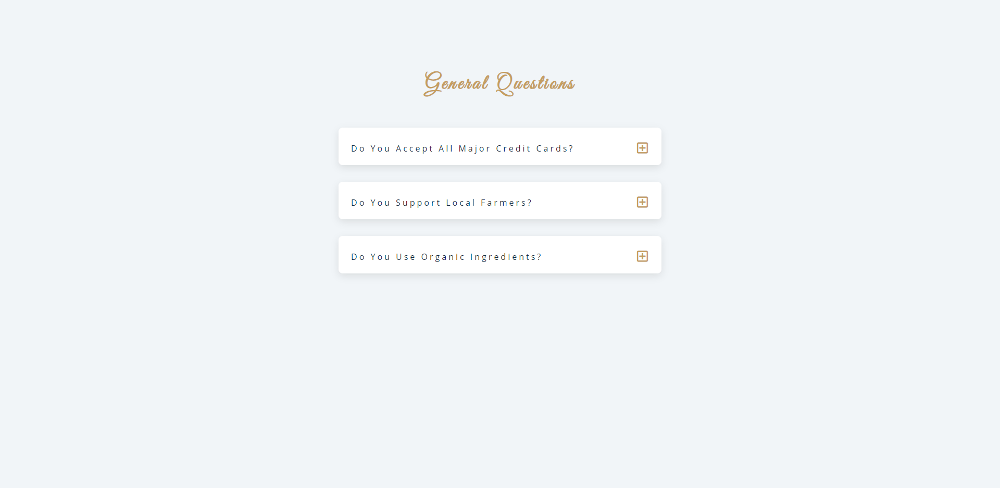

## Table of contents

- [Overview](#overview)
  - [The project](#the-project)
  - [Screenshot](#screenshot)
  - [Links](#links)
- [My process](#my-process)
  - [Built with](#built-with)
  - [What I learned](#what-i-learned)
  - [Continued development](#continued-development)

## Overview

### The challenge

- The aim of this project was to create a a simple Q&A page whereby the user would be able to click on the '+' icon to reveal the answer to a question and
click the '-' to hide it.

### Screenshot



### Links

- Live Site URL: https://aidenm99.github.io/Questions/

## My process

### Built with

- Semantic HTML5 markup
- CSS custom properties
- JavaScript

### What I learned

- Use of the currentTarget selector and also utilising parentElement to target the desired element

```js
for (i=0; i<buttons; i++){
  document.querySelectorAll(".question-btn")[i].addEventListener("click", function(){
      var target = event.currentTarget;
      target.parentElement.parentElement.classList.toggle("show-text");
    });
  };
```

### Continued development

- I plan to keep honing my JavaScript skills, building projects to do so in order to become more competent at the language as a whole.

